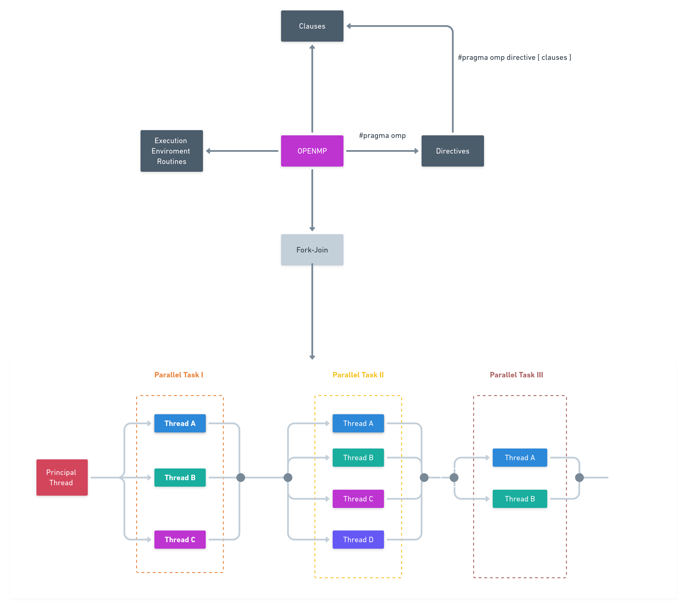

# openmp

## :book: Description
OpenMP (Open Multi-Processing) is API that supports multi-platform shared-memory multiprocessing programming in C, C++, and Fortran. This repository has basic concepts and parallel code such as directives, clauses and executing the environment routines.

 
## 👨🏻‍💻 compile the code with: 

`gcc NameFile.c -o outFile -fopenmp`
 or 
`g++ NameFile.cpp -o outFile -fopenmp`

### 💻 Execute:

`./outFile`